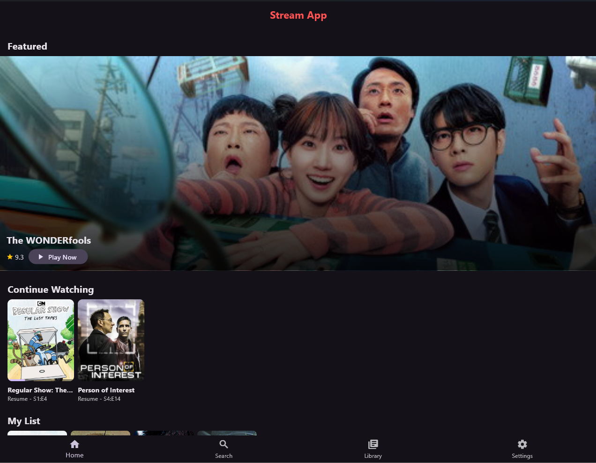
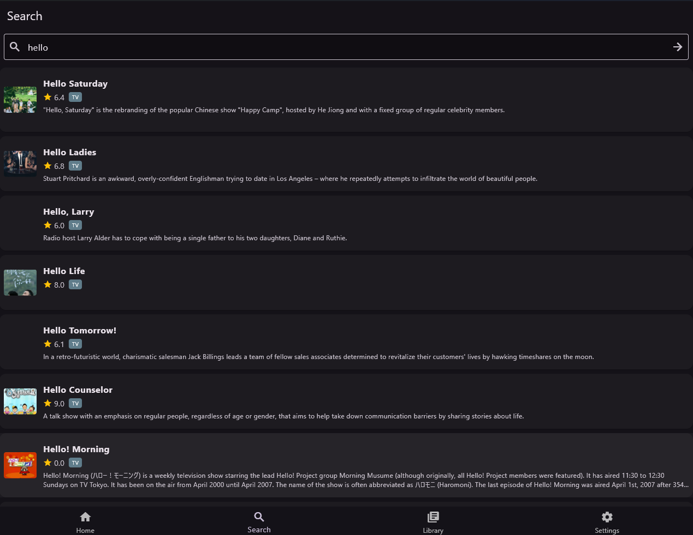
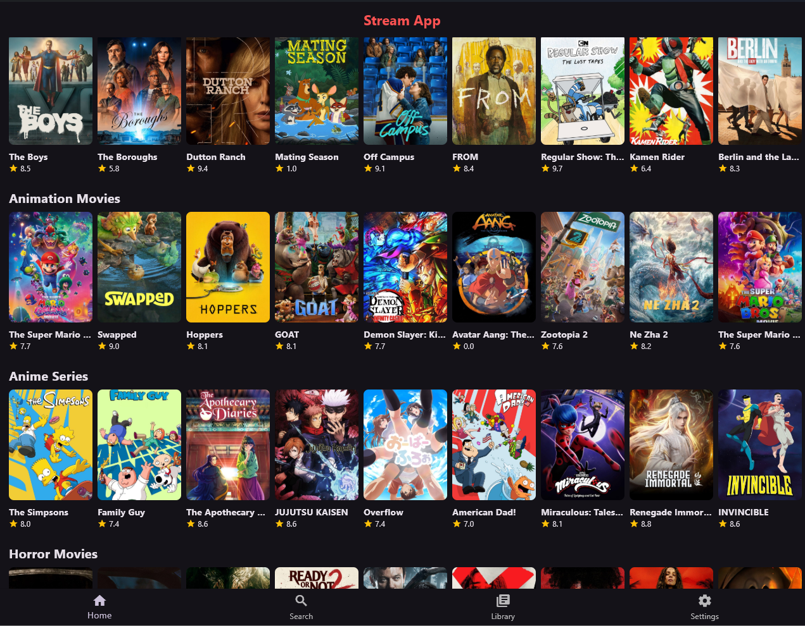
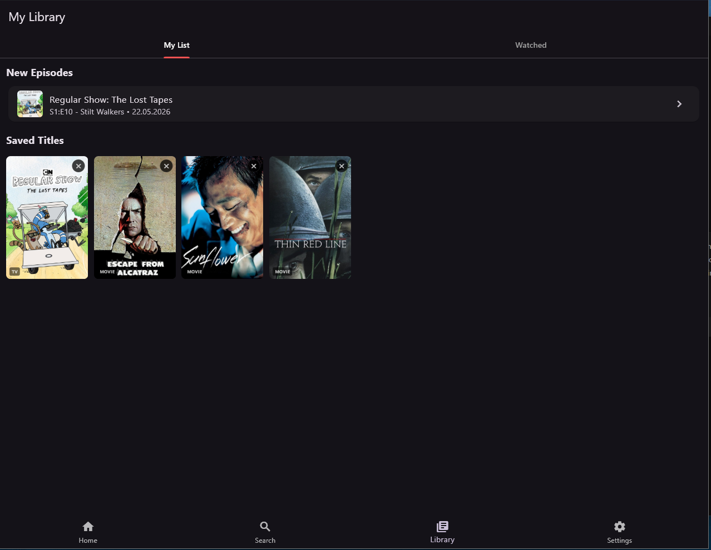

# StreamApp

StreamApp is a Flutter media browsing and playback app with a local FastAPI backend.
It supports movies/series discovery, source resolution through add-ons, in-app playback,
watch history, a personal library, and runtime app settings.

## Highlights

- Flutter client for Windows/Android (plus default Flutter platform folders).
- Local FastAPI backend for stream resolution.
- Add-on manager (install, enable/disable, remove custom add-ons).
- Add-on manager supports install from URL and local `.json` manifest file.
- Movie/series detail pages with source resolution and playback.
- Personal library (save/remove titles).
- Watch history with progress tracking.
- Settings screen:
  - App language (`English`, `Turkce`)
  - Subtitle language
  - TMDB access token (not hardcoded in repository)
  - Source auto-selection (avoid asking source every play)
  - Preferred source selection
  - Source/Add-on management pages

## Screenshots

<p align="center">
  
  
</p>
<p align="center">
  
  
</p>

## Tech Stack

- Flutter + Riverpod + Hive + Dio
- FastAPI + Uvicorn + httpx
- VLC/WebView-based playback depending on stream type/platform

## Download

### Android

| Architecture | File | Size |
|-------------|------|------|
| ARM64 (most devices) | [app-arm64-v8a-release.apk](https://github.com/serdevir91/stream_app/releases/download/v1.0.12/app-arm64-v8a-release.apk) | ~32.7 MB |
| ARM 32-bit (older devices) | [app-armeabi-v7a-release.apk](https://github.com/serdevir91/stream_app/releases/download/v1.0.12/app-armeabi-v7a-release.apk) | ~29.9 MB |
| x86_64 (emulators) | [app-x86_64-release.apk](https://github.com/serdevir91/stream_app/releases/download/v1.0.12/app-x86_64-release.apk) | ~37.4 MB |

> Most modern phones use ARM64. If unsure, download the ARM64 version.

### Windows

| Type | File | Size |
|------|------|------|
| Installer (recommended) | [StreamApp-Setup-v1.0.12.exe](https://github.com/serdevir91/stream_app/releases/download/v1.0.12/StreamApp-Setup-v1.0.12.exe) | ~25.1 MB |
| Portable | [stream_app-windows-x64.zip](https://github.com/serdevir91/stream_app/releases/download/v1.0.12/stream_app-windows-x64.zip) | ~32.5 MB |

**Installer**: Run the `.exe` wizard. Creates Start Menu shortcuts and an uninstaller.

**Portable**: Extract the ZIP and run `stream_app.exe` directly. No installation needed.

## Project Structure

```text
stream_app/
  lib/
    core/
      i18n/
      settings/
      backend_bootstrap_service.dart
    features/
      home/
      search/
      player/
      library/
      addons/
      sources/
      settings/
  backend/
    main.py
    addons/
  android/
  windows/
```

## Prerequisites

- Flutter SDK (Dart included)
- Python 3.10+
- Windows build tools (for `flutter build windows`)
- Android SDK/Java (for `flutter build apk`)

For Windows build, `nuget.exe` must be available in `PATH`.

## Setup

1. Install Flutter dependencies:

```bash
flutter pub get
```

2. Install backend dependencies:

```bash
cd backend
pip install -r requirements.txt
```

3. Run app (Flutter will try to bootstrap local backend on desktop):

```bash
flutter run -d windows
```

Optional: run backend manually:

```bash
cd backend
uvicorn main:app --reload --host 127.0.0.1 --port 8000
```

## Settings and API Token

StreamApp uses [TMDB (The Movie Database)](https://www.themoviedb.org/) API for movie/series discovery. You need a free API token to use the app.

### How to Get a TMDB API Token

1. **Create a TMDB account**: Go to [themoviedb.org/signup](https://www.themoviedb.org/signup) and register (free).

2. **Go to API settings**: Visit [themoviedb.org/settings/api](https://www.themoviedb.org/settings/api).

3. **Request an API key**:
   - Click **"Create"** under the API section.
   - Select **"Developer"** as the use case.
   - Accept the terms of use.
   - Fill in the required application details (app name, description, URL).

4. **Copy your API Read Access Token**: After approval, you will see an **API Read Access Token** (a long `eyJ...` string). This is the token you need.

   > **Important**: Use the **API Read Access Token**, not the API Key. They are different.

5. **Paste in StreamApp**: Open the app -> **Settings** tab -> paste the token in the **TMDB Access Token** field -> Save.

### In-App Settings

- Open the **Settings** tab in the app.
- Set your **TMDB Access Token** (see above).
- Configure source behavior:
  - `Auto play best source` enabled: app starts playback directly.
  - `Preferred Source`: pick a specific add-on, or leave Auto.
- Save settings.

The token is stored locally (Hive) and synced to backend at runtime.
No TMDB token is committed in source code.

## In-App Usage Guide

### Searching and Watching Content

1. Open the **Search** tab from the bottom navigation.
2. Type a movie or series name in the search bar and press enter.
3. Tap on a result to open its **Detail Page**.
4. For movies, tap **"Resolve Sources and Play"** or **"Play Now"** to start playback.
5. For series:
   - Select a **Season** from the season list.
   - Tap an **Episode** to start playback.
6. Playback opens in fullscreen. Use on-screen controls for play/pause, seek, and speed adjustment.

### Library (Saving Titles)

1. On any movie/series detail page, tap the **bookmark icon** or **"Add to Library"** button.
2. Saved titles appear in the **Library** tab under **"Saved Titles"**.
3. To remove, open the detail page again and tap **"Remove from Library"**.

### Continue Watching

- StreamApp automatically tracks your watch progress.
- Partially watched titles appear in the **"Continue Watching"** row on the Home screen.
- Tap a title to resume from where you left off.
- To remove an item from Continue Watching, long-press on the item and confirm removal.

### Add-on Management

1. Go to **Settings -> Add-ons** (or the **Add-ons** tab).
2. View the list of installed and built-in add-ons.
3. To install a new add-on:
   - Tap **"Add Add-on"**.
   - Enter a **Stremio manifest URL** or choose **"Install from file (.json)"** for a local manifest.
4. To disable or remove an add-on, tap its entry and select the appropriate action.
5. Tap **"Refresh"** if add-ons appear empty on first use.

### Source Configuration

1. Open **Settings**.
2. **Auto play best source**: When enabled, the app automatically picks the best available source and starts playback without asking.
3. **Preferred Source**: Select a specific add-on to always use, or leave as **"Auto (best available)"**.
4. These settings are saved locally and take effect immediately.

### Language Settings

1. Open **Settings**.
2. **App Language**: Switch between English and Turkish.
3. **Subtitle Language**: Set the preferred subtitle language (used by embed players that support subtitle selection).

## Build

### Windows EXE

```bash
flutter build windows --release
```

Output:

```text
build/windows/x64/runner/Release/stream_app.exe
```

### Windows Installer

Requires [Inno Setup 6](https://jrsoftware.org/isinfo.php).

```bash
# Build Windows release first
flutter build windows --release

# Compile installer
"C:\Program Files (x86)\Inno Setup 6\ISCC.exe" installer\stream_app.iss
```

Output: `output/StreamApp-Setup-v1.0.11.exe`

### Android APK

```bash
# Single APK (all architectures, ~180MB)
flutter build apk --release

# Split APKs by architecture (recommended, ~55-70MB each)
flutter build apk --split-per-abi --release
```

Output:

```text
build/app/outputs/flutter-apk/app-arm64-v8a-release.apk
build/app/outputs/flutter-apk/app-armeabi-v7a-release.apk
build/app/outputs/flutter-apk/app-x86_64-release.apk
```

## QA

Run static checks and tests:

```bash
flutter analyze
flutter test
```

## Notes

- If Windows build fails with file lock errors, close any running `stream_app.exe` and build again.
- If add-ons appear empty on first use, refresh once from the Add-ons screen.

## Built-in Add-ons

StreamApp ships with the following source add-ons:

| Add-on | Type | Description |
|--------|------|-------------|
| **VidSrc** | Embed | Multi-source embed provider |
| **TwoEmbed** | Embed | 2embed.cc streaming source |
| **SuperEmbed** | Embed | SuperEmbed embed provider |
| **VidLink** | Embed | VidLink embed provider |
| **EmbedSU** | Embed | Embed.su streaming source |
| **StreamIMDB / VidAPI** | Embed | Vaplayer/VidAPI embed source with subtitle language support |
| **FlixHQ** | API/Scraping | FlixHQ movie/series source |
| **Archive.org** | API | Internet Archive content (disabled by default) |
| **WebTorrent** | API | WebTorrent-based streaming (disabled by default) |
| **Jellyfin** | API | Jellyfin media server integration (disabled by default) |

## Add-on Creation Guide

Other users can create and share add-ons by publishing a compatible backend API.

### 1. Required Manifest JSON

Create `manifest.json`:

```json
{
  "id": "community.example",
  "name": "Community Example Addon",
  "description": "Sample addon for Stream App",
  "version": "1.0.0",
  "types": ["movie", "series"],
  "transportUrl": "https://your-addon-domain.com",
  "icon": "film"
}
```

`transportUrl` is required when installing from a local file.

### 2. Required API Endpoints

Your backend must expose:

- `GET /search?query=<text>&type=movie|series`
- `GET /stream?id=<contentId>&type=movie|series&season=<n>&episode=<n>`

`/search` response:

```json
{
  "results": [
    {
      "id": "movie_123",
      "title": "Example Movie",
      "type": "movie",
      "year": "2024",
      "poster": "https://.../poster.jpg",
      "description": "Optional"
    }
  ]
}
```

`/stream` response:

```json
{
  "streams": [
    {
      "url": "https://.../playlist.m3u8",
      "title": "Example Stream",
      "quality": "1080p",
      "provider": "Example",
      "is_direct_link": true
    }
  ]
}
```

### 3. Install in App

- Open `Settings -> Add-ons`.
- Choose one:
  - `Install from URL` and provide addon manifest URL.
  - `Install from file (.json)` and choose local manifest file.

## Changelog

### v1.0.11

- **Separate Sequels and Recommendations**: Separated sequels/prequels/spin-offs and similar genre recommendations into two distinct horizontal scrolling lists on the details page.
- **Builds**: Generated split-per-ABI Android APKs, Windows Release build, installer executable, and refreshed portable ZIP for the `v1.0.11` release.

### v1.0.10

- **Exclude Watched Content from Recommendations**: Both homepage recommendations and movie detail recommendations now fully exclude titles that are marked as watched or have completed progress in watch history.
- **TMDB Token Step-by-Step Instructions**: Created an interactive step-by-step guideline dialog accessible directly from the token warning banner on the Home and Search pages, making TMDB API setup significantly easier.
- **TV Series Continuation Guard**: Converted "Continue Watching" provider to verify TV episode release/air dates before showing them, hiding series from the list if the next episode (or next season's first episode) has not aired yet.
- **Sequels & Similar Recommendations**: Added a section to the movie detail page showing sequels/prequels/spin-offs (from TMDB collection) or similar genre recommendations as a fallback.
- **Clock-Drift Synchronization Fix**: Revamped client-server syncing (`sync_server.py` & `sync_service.dart`) to use server-side timestamps rather than client clocks, preventing update loss and guaranteeing reliable syncing.
- **Builds**: Generated split-per-ABI Android APKs, Windows Release build, installer executable, and refreshed portable ZIP for the `v1.0.10` release.

### v1.0.9

- **Anime Source Stability**: Prioritized anime-friendly embed providers for TV animation content and collected multiple fast provider results before auto-selecting a stream, reducing cases where playback starts from weak English-only/no-subtitle sources.
- **In-App Updates**: Fixed the displayed/current app version by reading package metadata at runtime instead of a stale hard-coded value, and added Android APK download plus installer handoff directly from the app.
- **Builds**: Generated split-per-ABI Android APKs, Windows Release build, installer executable, and refreshed portable ZIP for the `v1.0.9` release.

### v1.0.8

- **Expandable Categories**: Expanded all home screen category rows (recommended, trending, genre lists, decades) so that tapping the category header or the new trailing chevron icon routes users to a detailed grid view of the category catalog.
- **VidSrc Player Click & Overlay Fix**: Injected an advanced overlay click-bypass and anti-popup script engine into Android, iOS, and Windows WebViews. This completely hides transparent ad overlays and disables tap highlight flashing, unblocking play/pause, seek, and other player controls.
- **Auto Cloud Sync**: Implemented automatic cloud synchronization of watch history progress, personal library, marked-as-watched status, app settings/customizations, and custom addon sources immediately upon application startup.
- **Builds**: Generated split-per-ABI Android APKs and Windows Release installer executable for the `v1.0.8` release.

### v1.0.7

- **UI/UX Refinements**: Replaced the separate brand cards hub with fully integrated, customizable homepage categories for major studio brands (Marvel, Disney, DC Studios, DreamWorks, Paramount, Netflix, HBO, Prime Video, Pixar, Warner Bros., Universal), allowing users to reorder them in the Settings and click category headers to view the full brand catalog.
- **Details Page Polish**: Updated the release date badge to display the full `DD.MM.YYYY` date instead of just the year, and localized the runtime duration suffix (`min` in English, `dk` in Turkish) while removing duplicate release date and duration detail rows from the bottom details card.
- **Modern Branding**: Replaced application icons with a new simple minimalist play logo across Windows, Android, and iOS formats.
- **In-App Updates**: Implemented automatic update checking and installation within the Settings screen using the GitHub Releases API.
- **Build**: Generated and published split-per-ABI APKs and Windows installer setup for the `v1.0.7` release.

### v1.0.6

- **Search**: Added credits lookup (movies/series directed or acted in) when searching for directors or actors, and implemented a Jaro-Winkler fuzzy sorting system to rank matches and correct spelling typos.
- **Homepage Categories**: Implemented customizable homepage category rows, allowing users to reorder, add, or remove rows via a new Settings manager.
- **Quick Setup**: Integrated direct TMDB Access Token input directly within the homepage warning banner to make initial setup significantly faster and more convenient.
- **Build**: Updated split-per-ABI APKs and Windows installer scripts for the new release.

### v1.0.5

- **Security/Sync**: Removed shared Oracle default endpoint usage and blocked shared default host registration in-app.
- **Sync UX**: Improved device registration reliability with pre-flight health checks and clearer timeout/connection errors.
- **Local Backup**: Added JSON export/import for local data backup and restore from Settings.
- **Build**: Refreshed Android split-per-ABI APKs and Windows installer/portable artifacts.

### v1.0.4

- **Auto-remove Watched Content**: Automatically removes movies/series from "My List" once marked as watched or when progress reaches 100% completion.
- **TV Show Completion Tracking**: TV shows are automatically marked as completed and removed from "My List" only when all episodes across all seasons have been watched.
- **Release Date & Director Info**: Displays release dates on details pages and explicitly lists both Creator and Director names for TV shows when available.
- **Localized Type Badges**: Displays a small type badge ("DİZİ" / "FİLM") on the bottom-left corner of all cover posters.

### v1.0.3

- **Android subtitles**: Added document-start WebView injection for StreamIMDB/VidAPI Turkish subtitle text fixes.
- **StreamIMDB/VidAPI**: Uses Vaplayer URLs and passes subtitle language parameters for automatic subtitle selection.
- **Player**: Fixed embed touch handling so provider controls such as subtitle language selectors can receive taps.
- **Continue Watching**: Preserves the selected source per watch history entry, avoiding fallback to the wrong provider.
- **Sync/Library**: Improved watch history and library sync metadata handling.
- **Windows installer**: Packages the full Windows release folder so media playback DLLs are included.
- **Build**: Updated Android dependency setup for current Flutter Android plugin embedding.

### v1.0.2

- **Removed**: Skip Intro and Skip Recap features removed from the player
- **Security**: Improved `.gitignore` rules for log files and database files
- **Docs**: Added in-app usage guide to README

### v1.0.1

- **New Add-ons**: SuperEmbed, TwoEmbed, VidLink, EmbedSU, FlixHQ
- **Redesigned Home Screen**: Featured content slider with trending movies/series
- **Improved Search**: Genre filtering, pagination, better results layout
- **Enhanced Player**: Better subtitle support, improved controls, VLC/WebView switching
- **Redesigned Settings**: Organized sections, better UX
- **Addon Manager**: Improved install/remove flow, URL and file-based install
- **Watch History**: Better progress tracking, resume playback
- **i18n**: Updated English and Turkish translations
- **Bug Fixes**: Various stability improvements

### v1.0.0

- Initial release
- TMDB integration for movie/series discovery
- Basic add-on system with VidSrc
- VLC and WebView playback
- Personal library and watch history
- Windows and Android support

## License

MIT License
